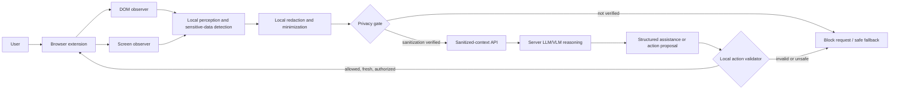
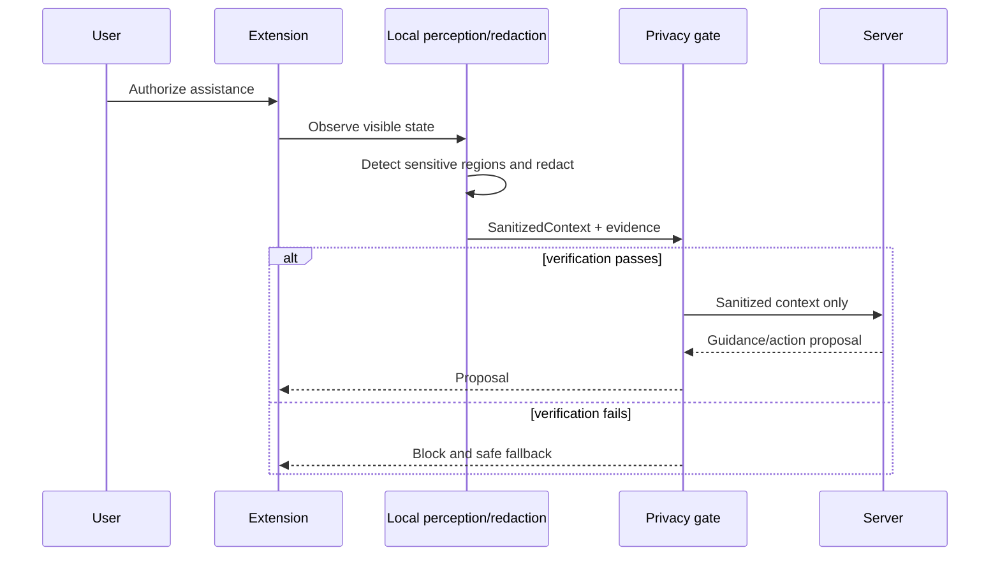
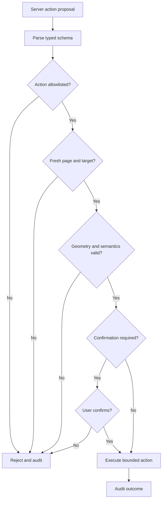
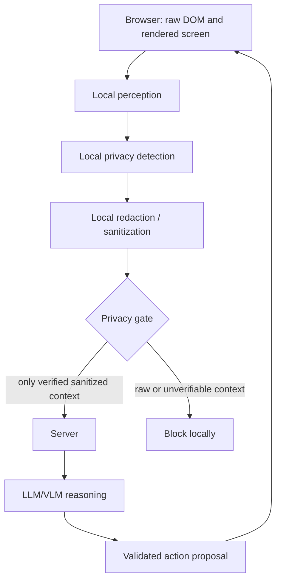

# Project VEIL Architecture

## Status and decision labels

- [CONFIRMED] Explicitly required by the supplied SIH problem statement.
- [PROPOSED] Recommended design for the prototype; not an official requirement.
- [TBD] Not decided from the available evidence.
- [REQUIRES BENCHMARK] Cannot be responsibly selected without measurement.

## 1. High-level architecture

[CONFIRMED] The solution requires a browser extension/JavaScript client and a server. Local browser processing must sanitize visual context before it is sent to the central LLM/VLM. The server may return processed data or browser UI actions.

[PROPOSED] The client is the privacy enforcement point and action safety authority. The server is an untrusted-with-respect-to-raw-screen-data reasoning service: it receives only the versioned sanitized context contract and never browser capture objects or raw DOM text. The architecture is deliberately capability-based: server output can suggest assistance, but cannot execute arbitrary browser code.

## 2. Architecture comparison

### A. DOM-first

- **Privacy:** [PROPOSED] Strong for semantically marked fields because data can be excluded before rendering/capture, but weak against text embedded in canvas, images, videos, or misleading/missing markup.
- **Visual understanding:** [PROPOSED] Limited to page-provided semantics; cannot reliably recover visual hierarchy, rendered state, faces, or non-DOM content.
- **PII detection:** [PROPOSED] Efficient for `input[type=password]`, autocomplete hints, labels, and configured selectors; incomplete for pixel-only PII.
- **Robustness:** [PROPOSED] Breaks when websites use poor semantics, shadow DOM edge cases, canvas, cross-origin frames, or custom widgets.
- **Latency/resource usage:** [PROPOSED] Best of the three approaches.
- **Implementation complexity:** [PROPOSED] Lowest.
- **SIH evaluation alignment:** [INTERPRETATION] Insufficient by itself because the statement explicitly requires local visual perception and cites face blurring and visual context accuracy.
- **Failure modes:** [PROPOSED] False sense of safety from missing or deceptive DOM metadata; poor coverage of non-textual sensitive content.

### B. Screenshot / vision-first

- **Privacy:** [PROPOSED] Can cover arbitrary pixels, but raw capture exists locally and must be rigorously contained; all sensitive regions depend on detection quality.
- **Visual understanding:** [PROPOSED] Strongest for rendered layout, faces, image text, canvas, and visually expressed state.
- **PII detection:** [PROPOSED] Broad coverage but vulnerable to OCR/detection misses, small text, occlusion, and visual diversity.
- **Robustness:** [PROPOSED] Less dependent on site semantics but sensitive to resolution, styling, localization, viewport, and model generalization.
- **Latency/resource usage:** [PROPOSED] Highest; browser-local inference/capture may be expensive.
- **Implementation complexity:** [PROPOSED] High, including secure capture lifecycle and local model runtime.
- **SIH evaluation alignment:** [INTERPRETATION] Strong for visual context and face detection, but riskier for resource utilization and latency.
- **Failure modes:** [PROPOSED] Missed sensitive pixels or overly broad masks; model and runtime feasibility issues.

### C. Hybrid DOM + visual perception

- **Privacy:** [PROPOSED] Use deterministic DOM signals as high-confidence early masks and visual detection to cover pixel-only content; each signal is subject to a conservative privacy policy.
- **Visual understanding:** [PROPOSED] Retains pixel-level understanding while adding semantic structure useful for task reasoning.
- **PII detection:** [PROPOSED] Covers explicit web fields and visual-only sensitive data, reducing the single-modality blind spots.
- **Robustness:** [PROPOSED] Better across conventional forms and semantically poor/custom UIs, though cross-origin/frame limits still need explicit handling.
- **Latency/resource usage:** [PROPOSED] Higher than DOM-first, but vision can be scoped to relevant regions and invoked on demand; this must be benchmarked.
- **Implementation complexity:** [PROPOSED] Moderate to high because coordinate systems, evidence fusion, and failure policy must be consistent.
- **SIH evaluation alignment:** [INTERPRETATION] Best fit for all five metrics: use DOM to reduce local cost and strengthen PII recall, vision for required visual coverage, and minimization to preserve latency.
- **Failure modes:** [PROPOSED] Signal disagreement, coordinate mismatches, and unnecessary visual processing; mitigate through union masking, source provenance, and a single viewport coordinate contract.

### Recommended architecture

[PROPOSED] Use a **DOM-first hybrid with targeted visual fallback**. It is justified because the official requirement combines visual perception with dynamic sensitive-data detection, while neither DOM-only nor vision-only covers both reliable explicit field detection and arbitrary rendered visual content. DOM is the normal fast path. Local vision is invoked for the selected task and when DOM evidence is absent, conflicting, or visually incomplete—for example, visible faces, canvas/image text, custom controls, or rendered layout ambiguity. This avoids treating vision as the default for every page while retaining the local visual demonstration required by SIH. Exact fallback triggers and their performance remain [REQUIRES BENCHMARK].

## 3. Browser/client architecture

[PROPOSED] The extension has separable modules with narrow data privileges:

- Session controller: user start/pause/cancel state and explicit consent surface.
- Page observer: gathers permitted DOM-derived signals, watches material authorized-page changes, and coordinates capture of the current visible viewport.
- Local perception adapter: runs the selected lightweight visual process only in-browser.
- Sensitive-data policy engine: combines deterministic and visual candidate regions with source/confidence provenance.
- Redaction renderer: applies irreversible blackout, blur, or masking to an ephemeral local representation.
- Context builder and privacy gate: constructs and verifies the only network-eligible payload.
- Transport client: sends only gate-approved payloads.
- Action validator/executor: interprets structured server proposals, validates them against live state, and performs permitted actions.
- Local audit log: stores minimal event metadata, never raw captures or raw sensitive values.

[PROPOSED] Privileged extension components and page-facing components communicate through typed, validated messages bound to the active tab, origin, and assistance session. Webpage objects, DOM text, and content-script messages are untrusted input; they must not be used as privileged instructions or directly passed to transport.

[TBD] Manifest version, extension API details, cross-origin frame policy, storage mechanism, exact capture API, and model runtime are implementation decisions for later research. The browser is not treated as a universally trusted runtime: this design mitigates hostile webpage/script influence, but does not claim to protect against a compromised user device or browser process.

## 4. DOM observation

[PROPOSED] DOM observation produces an allowlisted, task-relevant structural summary and local-only sensitive candidates. Deterministic signals include input type, autocomplete hints, labels, ARIA attributes, configured selectors, and element visibility/bounding rectangles. Raw values of inputs, full page HTML, broad text extraction, and arbitrary attributes are not network-eligible.

[PROPOSED] DOM signals can mark known sensitive fields before visual processing. They cannot establish that all rendered sensitive content is covered, so they are not the sole privacy control.

[PROPOSED] During an active session, a scoped, debounced page-change observer detects material DOM/state changes and invalidates affected context/action proposals. It must disconnect on session end. Open-shadow-root traversal may be evaluated as a local signal; closed shadow roots, cross-origin frames, and canvas-only controls remain visual-fallback or unsupported cases rather than reasons to collect broader DOM data.

## 5. Screenshot / screen observation

[CONFIRMED] The client must interpret the current screen locally through lightweight vision processing.

[PROPOSED] Capture only the active, user-authorized tab's visible task-relevant viewport after user activation, at the lowest resolution that preserves the selected task. Treat every raw capture as sensitive local ephemeral data: do not persist it, include it in logs, or hand it to transport. Convert all detection coordinates to a documented viewport-pixel coordinate system that records browser zoom/device scale for later target revalidation.

[REQUIRES BENCHMARK] Capture rate, resolution, regional clipping, and whether a full viewport is necessary. The choice must optimize visual-context accuracy against client resource usage and latency; selective capture is not assumed to be correct before its privacy coverage and task accuracy are measured.

## 6. Local visual perception and sensitive-data detection

[CONFIRMED] Local lightweight vision processing and dynamic sensitive-data redaction are required; face blur, password blackout, and PII masking are stated examples.

[PROPOSED] Detection runs locally and returns candidate regions, category, confidence, and source—not extracted raw sensitive content. Candidates may come from DOM rules, local deterministic patterns for the chosen taxonomy, face detection, visual text/OCR plus local PII matching, or task-structure perception. The policy engine maps all candidates into a common coordinate system and normally redacts the union of sensitive regions. Deterministic patterns are high-value for structured identifiers but are not sufficient for names, faces, free text, or visually embedded content.

[TBD] The sensitive-data taxonomy may include India-relevant formats only if they are within the chosen demo scope; the official statement does not prescribe Aadhaar, PAN, IFSC, UPI, or any other regional identifiers.

[REQUIRES BENCHMARK] Exact model(s), runtime, quantization, confidence thresholds, fusion logic, and whether any OCR is viable in-browser. A fixed model stack or a native companion application is premature and outside the stated browser extension/JavaScript client scope unless later requirements justify it.

## 7. Local redaction

[CONFIRMED] Sensitive elements must be redacted locally before visual context is transmitted.

[PROPOSED] Use category-appropriate irreversible transformations: opaque block for passwords and high-risk text, masking/tokenization for safe structural metadata, and blur or opaque cover for face regions. Expand masks by a documented safety margin so edge pixels do not leak. The context builder receives only the rendered-redacted image/regions and allowlisted safe metadata; it cannot access the original capture interface.

[PROPOSED] When detection is uncertain, do not pass the underlying region as safe. Use a conservative mask, reduce context to non-sensitive regions, require user resolution, or cancel the request. This deliberately trades some task context for privacy.

## 8. Sanitized-context construction

[PROPOSED] The server contract is versioned and minimizes data. A sanitized payload may include:

- protocol version and request/session nonce;
- sanitized visual context: a redacted viewport or selected redacted regions only;
- coordinate metadata: viewport size, scale, and coordinate-system version;
- redaction map semantics: masked region bounding boxes, category labels, transformation type, and confidence band, never raw values;
- safe structural metadata: allowlisted role/type/state summaries and stable local target handles, with sensitive values omitted;
- task intent and explicitly allowed action capabilities;
- integrity evidence: a gate-generated payload identifier and sanitization-policy version.

[PROPOSED] Sanitized context excludes raw screenshots, original crops, unredacted OCR text, passwords, input values, complete DOM/HTML, browsing history, and opaque client-side capture references.

## 9. Local vs server responsibilities

- **Raw screenshot/capture:** Generated locally; potentially sensitive in its entirety; must not leave the device. It is used ephemerally only for local detection and redaction.
- **Redacted image/regions:** Generated locally; residual risk remains; may leave only after privacy-gate verification. It preserves layout and task context without identified sensitive regions.
- **Raw OCR text:** Generated locally; often sensitive; must not leave the device. It is used only for local detection and is excluded from the sanitized payload.
- **PII labels and boxes:** Generated locally; potentially sensitive metadata; may leave in minimized form only when needed for server interpretation. Send coarse category and redaction geometry, never values.
- **DOM metadata:** Generated locally; mixed sensitivity; may leave only when allowlisted. Use task-grounding roles, states, and geometry; omit values, labels, URLs, and attributes unless explicitly classified safe.
- **Bounding boxes:** Generated locally; context-dependent sensitivity; may leave as viewport-relative sanitized geometry for redaction or action grounding, without hidden data.
- **Browser actions:** Proposed by the server and safety-sensitive; may return to the device only as strict, capability-constrained structured data that the client revalidates locally.

## 10. Client/server communication and privacy gate

[CONFIRMED] Privacy enforcement must occur before every network request that carries visual context.

[PROPOSED] Only the context builder can call the visual-context transport, and it accepts an opaque `SanitizedContext` object produced by the privacy gate—not a screenshot, canvas, blob, OCR result, or arbitrary DOM object. The gate builds a fresh allowlisted serialization rather than forwarding caller-provided JSON; it strips unknown keys and rejects prohibited fields/types, raw-capture references, missing redaction evidence, invalid coordinates, oversized payloads, or an invalid request purpose. Failed verification blocks transport and returns a local safe-fallback status.

[PROPOSED] Network-layer controls should restrict the extension’s server destinations, keep capture/perception modules without transport access, and log metadata-only gate decisions. Unit and integration tests should attempt prohibited payload construction, unexpected keys, raw-text/base64 fields, and direct transport calls, then verify they cannot reach the transport boundary. A secondary pattern scan of allowed serialized fields may be used as defense in depth, but cannot replace schema minimization and local redaction. TLS protects transit but is not a substitute for local sanitization.

## 11. Server-side reasoning and LLM/VLM integration

[CONFIRMED] The server interprets anonymized context through a central LLM/VLM and returns processed data or browser actions. Cloud-hosted use is allowed during SIH.

[PROPOSED] The server validates the payload schema and redaction-map version before reasoning. It is designed to reason with redacted visual layout plus safe metadata, treating masked regions as unknown rather than trying to infer their contents. All webpage-derived text and metadata are explicitly framed as untrusted data, not instructions; task policy and allowed action capabilities remain separate. It returns a typed response: user-facing guidance, task-state interpretation, or structured action proposal.

[TBD] Exact server deployment, LLM/VLM, prompt/template, model hosting, and offline strategy. No server model is selected in this phase.

## 12. Browser action generation, validation, and execution

[PROPOSED] The server may propose only a small action schema, for example: highlight a local target, scroll a bounded amount, open a safe navigation target, focus a non-sensitive field, or click a user-approved target. Text entry, submission, account changes, downloads, external navigation, purchases, financial effects, and permission grants require explicit, just-in-time user confirmation or are denied until a task-specific policy is decided.

[PROPOSED] A proposed action contains an action type, allowed capability, target descriptor, expected page/element fingerprint, optional viewport geometry, expiry, and explanation. It contains no executable JavaScript.

[PROPOSED] Before execution, the client checks:

- action type is in the local allowlist and within the active session capability;
- page origin, page state, and action expiry match current state;
- target resolves uniquely to a live visible element using local data;
- target fingerprint, role/state, and coordinates agree within tolerance;
- target is not sensitive, hidden, covered, cross-origin inaccessible, or changed since context capture;
- user confirmation is present for every high-impact action; no server response alone can satisfy that requirement.

[PROPOSED] On failure, execute nothing. Refresh sanitized context only after renewed authorization and privacy-gate processing, or give the user a safe explanation.

## 13. Failure-safe behavior and error handling

[PROPOSED] Privacy, action safety, and server availability fail closed. Detection failures, unknown page regions, redaction-rendering failures, invalid payloads, network errors/timeouts, incompatible contract versions, worker/page lifecycle interruption, malicious responses, stale targets, and extension API errors must result in no visual-context transmission and no browser action. The client can offer local messaging, manual user guidance, retry after explicit consent, or a new sanitized capture.

[PROPOSED] Hostile webpages are assumed to be able to mutate DOM, obscure targets, use deceptive overlays, and change content between capture and action. Live local revalidation immediately before each action is therefore mandatory in the proposed design.

## 14. Privacy and trust boundaries

[PROPOSED] This boundary is enforced through module capability separation, an opaque sanitized-payload type, schema validation, prohibited-field checks, restricted transport access, and negative tests that prove raw visual objects cannot be passed to the transport function. It can be evidenced by request capture/log inspection that contains only redacted payload hashes/metadata and by demonstration fixtures with known secrets. These mechanisms reduce and test the risk; they do not justify an absolute claim of privacy without implementation and security testing.

## 15. Resource and latency considerations

[CONFIRMED] Client resource usage and end-to-end latency are evaluation criteria, and the statement calls for balancing inference latency against accuracy.

[PROPOSED] Process only on explicit assistance request or meaningful screen change; prioritize DOM-detected sensitive masks; crop/scale visual work to task-relevant regions; cache only non-sensitive ephemeral derived state within a session; cap payload size; and avoid re-processing before an action when live validation is sufficient.

[REQUIRES BENCHMARK] The appropriate model/runtime, resolution, region strategy, detection cadence, confidence thresholds, and client device budget. Measurements must show their impact on all five official metrics rather than optimizing one in isolation.

## 16. Answers to critical questions

### Why is DOM extraction alone not enough?

[INTERPRETATION] DOM cannot reliably represent rendered screenshots, canvases, images, videos, faces, visually meaningful layout, custom widgets, missing semantics, or deceptive markup. It is a valuable local signal but not complete visual perception or a complete sensitive-content detector.

### Why is visual perception required?

[CONFIRMED] The statement explicitly calls for local vision processing. [INTERPRETATION] It enables task-state and sensitive-region understanding when the needed information exists only in pixels or rendered layout.

### Why cannot raw screenshots be sent to the server?

[CONFIRMED] Only anonymized visual context may be transmitted, and privacy enforcement must occur before every visual-context request. A raw screenshot can contain passwords, PII, faces, and other identifiers.

### What is sanitized context?

[PROPOSED] A versioned, minimal package containing only locally redacted visual regions plus allowlisted safe structural metadata, a common coordinate system, redaction semantics, task intent, allowed capabilities, and verification evidence. It excludes original pixels and raw sensitive text.

### How can we demonstrate raw sensitive information never reaches the server?

[PROPOSED] Demonstrate enforced object-flow separation, gate rejection tests, payload-schema/prohibited-field tests, recorded network requests for fixtures containing known secrets, and server logs that show only sanitized fields. This is evidence of the implemented boundary, not an unsupported guarantee.

### What happens when PII detection is uncertain?

[PROPOSED] Treat uncertainty as unsafe: conservatively redact, reduce context, require user input, or cancel the request. The exact threshold/policy is [REQUIRES BENCHMARK].

### How is useful context preserved after redaction?

[PROPOSED] Preserve non-sensitive layout, element roles/states, redaction category/geometry, and task-relevant non-sensitive regions. The server treats masked content as unknown instead of reconstructing it.

### Which parts genuinely require ML?

[INTERPRETATION] Visual understanding where DOM is insufficient: rendered state/layout, face detection, pixel-level text discovery, and possibly grounding. Server task reasoning also benefits from LLM/VLM capability.

### Which parts should remain deterministic?

[PROPOSED] Network gating, DOM password rules, redaction rendering, payload/schema validation, permission and consent state, action allowlisting/revalidation, audit logging, and benchmark instrumentation.

### How are unsafe browser actions prevented?

[PROPOSED] Typed non-code proposals, local capability allowlists, live target/state/geometry validation, expiry, confirmation policies, no execution on ambiguity, and audit events.

### How does this address all five SIH criteria?

[INTERPRETATION] Hybrid perception supports visual-context accuracy; complementary DOM/visual signals support PII recall and precision; common-coordinate local masking supports redaction precision; on-demand/cropped local inference targets resource use; minimal payloads and bounded actions target latency. Measurements are still required to prove these claims.

### What are the three biggest technical risks?

- [PROPOSED] Missing sensitive pixels or incorrect redaction boundaries, especially in visual-only or adversarial content.
- [PROPOSED] Browser-local perception failing the combined resource, latency, and accuracy constraints.
- [PROPOSED] Unsafe or stale action grounding on dynamic or hostile pages.

### Which decisions remain unresolved pending evidence?

- [REQUIRES BENCHMARK] Model/runtime, resolution/cropping/cadence, confidence and mask-margin policy, payload form/size, and performance budgets.
- [TBD] Demo task, PII taxonomy, fixtures/dataset, evaluation thresholds, hardware/browser baseline, action policy, server model/deployment, and consent/retention policy.
